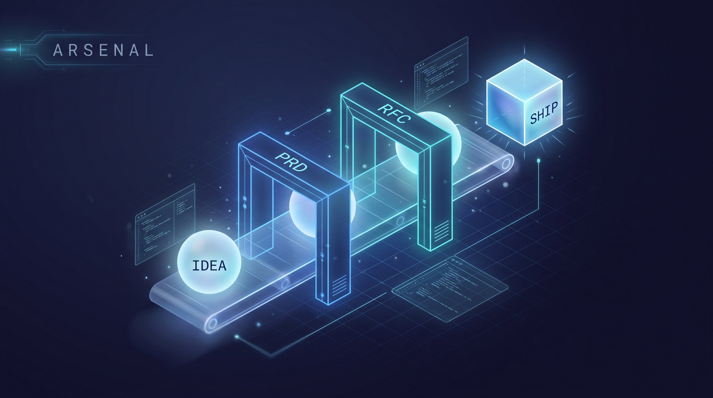

<p align="center">
  
</p>

<h1 align="center">arsenal</h1>

<p align="center">
  <a href="./LICENSE"></a>
  
  
</p>

<p align="center">
  Mirko Bozzetto's curated skills for AI coding agents: a spec-driven build pipeline plus the tools around it.
</p>

Skills here are plain markdown, portable across providers (Claude Code, Codex, Cursor, ...). Native plugin install is wired for Claude Code; other agents can load the skill files directly. Every plugin installs on its own. Pick what you need.

---

## What's in the arsenal

| Plugin | Category | What it does |
|--------|----------|--------------|
| [`code-roadmap`](./plugins/code-roadmap) | orientation | At task start, matches your intent against the skills you have installed and prints a recommended chain + execution mode + reflection level. Advisory, never forces a path. |
| [`prd`](./plugins/prd) | planning | Authors a product PRD by interview (the *what* and *why*), then derives a nested task list. Stops before code. |
| [`rfc`](./plugins/rfc) | planning | The *how*. A 10-step design workflow: problem → alternatives → tradeoffs → design → risks → recommendation → impl plan. Forces reasoning before action. |
| [`ship`](./plugins/ship) | implementation | The *build*. Executes a finalized `prd` or an Accepted `rfc` (or a bare prompt via an inline contract) on agent-teams / subagents / solo, and hands back a verification bundle you run + a trace ledger. |
| [`issue`](./plugins/issue) | memory | GitHub issues as cross-session resolution memory. Self-contained, cold-readable, resumable after any context reset. |
| [`next`](./plugins/next) | orientation | What's left and how to resume it. Derives an open-work board from `prd`/`rfc` frontmatter and recommends the next command; a SessionStart hook auto-surfaces it so context survives `/clear`. |
| [`websearch`](./plugins/websearch) | research | Intent-routed web search via [Exa](https://exa.ai) MCP: 8 modes (quick / deep / code / docs / debug / news / compare / research). |

---

## The build pipeline

The four planning-to-build plugins form one chain. The picture at the top is the whole thing: an idea enters, passes the **PRD** gate (what/why) and the **RFC** gate (how), and comes out the other side as shipped code.

```
            code-roadmap                         issue
          (orient: which path?)            (memory: resume cold)
                  │                                 ▲
                  ▼                                 │  (log when work must
   idea ──▶ prd ──▶ rfc ──▶ ship ──▶ shipped code  │   survive a reset)
          what/why   how    build                  │
            │         │       │                     │
            └─────────┴───────┴─────────────────────┘
```

**Suggested order, and what each step applies to:**

1. **`code-roadmap`**: when you're unsure where to start. Applies to *any* task; it only orients, it never runs anything. Skip it once the path is obvious.
2. **`prd`**: when the *what/why* isn't pinned down yet. Applies to a new feature or product change. Output: `docs/prd/<slug>/{prd.md, tasks.md}`.
3. **`rfc`**: when the *how* crosses a boundary: architecture, migration, a new pattern, or several valid designs where the wrong one is expensive to undo. Applies to technical decisions worth reasoning about. Output: `RFC.md` with alternatives + tradeoffs + an impl plan.
4. **`ship`**: to build. Applies to executing a finalized `prd` (`status: ready`) or an Accepted `rfc` (`status: Accepted`). Output: code + a `verification-bundle.md` you run yourself + a `trace.md` ledger.
5. **`issue`**: transversal. When a problem must survive a context reset, log it as a resumable GitHub issue and pick it up cold later.
6. **`next`**: transversal. Asks "what is left and how do I resume it" - derives the board from each `prd`/`rfc` status and points at the next `/ship`. `ship` closes the loop (flips `ready`/`Accepted` to `shipped` on finish), and a SessionStart hook re-surfaces the board so a `/clear` never loses the thread.

Not every task needs all four. A trivial change → `ship` directly (it derives a one-shot inline contract). A boundary-crossing feature → the full `prd → rfc → ship`. `code-roadmap` tells you which.

---

## A bit of history: PRD and RFC

These two artifacts aren't invented here: they're decades-old engineering discipline. The plugins just turn them into repeatable workflows.

### RFC: "Request for Comments" (1969)

The RFC series began in **April 1969**, when **Steve Crocker**, then a UCLA graduate student, wrote **[RFC 1, "Host Software"](https://www.rfc-editor.org/rfc/rfc1.html)** to organize the working notes of the ARPANET's Network Working Group. The name was deliberately humble: in Crocker's words, *"the basic ground rules were that anyone could say anything and that nothing was official... and to emphasize the point, I labeled the notes 'Request for Comments'"* ([The Origins of RFCs](https://datatracker.ietf.org/doc/html/rfc1000)). The goal was to **start the conversation, not freeze a standard**. The series went on to become the Internet's permanent record of design decisions, managed today through the IETF, and edited for 28 years by Jon Postel.

Engineering organizations later borrowed the form for internal design docs: the [Rust RFC process](https://rust-lang.github.io/rfcs/), Oxide's [Requests for Discussion](https://oxide.computer/blog/rfd-1-requests-for-discussion), Google design docs, the Kubernetes and Go proposal processes. The throughline never changed: **write the proposal down, weigh the alternatives and tradeoffs, reach consensus, all before you build.** The `rfc` plugin is exactly that discipline, slowed down in the right place.

### PRD: "Product Requirements Document"

The PRD comes from product management. The acronym standardized in the **1990s** waterfall era; the artifact was rewritten for agile in the 2000s. **Marty Cagan's ~2006 [How to Write a Good PRD](https://www.svpg.com/wp-content/uploads/2024/07/How-To-Write-a-Good-PRD.pdf)** was the canonical guide of its generation and led to his 2008 book *Inspired*.

The enduring definition: a PRD states **what** a release will do, **who** it's for, and **why** it matters, and is *deliberately silent on how*. The "how" belongs to the engineering-owned design doc (the RFC). It's distinct from the MRD (Market Requirements Document, which argues *should we build this at all*). Modern practice keeps it short: 1-3 pages, a living document, not a 50-page frozen spec. Cagan himself later [pushed teams toward discovery and prototypes over heavy documents](https://www.svpg.com/discovery-vs-documentation/): a reminder that the PRD is a means to clarity, not an end. The `prd` plugin runs it as an interview → a tight spec + a derived task list, and stops before code.

> **Why this ordering matters:** the single most common failure is letting the *what* and the *how* bleed together. Keeping `prd` (what/why) upstream of `rfc` (how) upstream of `ship` (build), each a separate and checkable artifact, is the whole point of the chain.

**Further reading**

- PRD: [How to Write a Good PRD (Marty Cagan / SVPG)](https://www.svpg.com/wp-content/uploads/2024/07/How-To-Write-a-Good-PRD.pdf) · [Discovery vs. Documentation (SVPG)](https://www.svpg.com/discovery-vs-documentation/) · [PRDs: A Modern Guide (Aakash Gupta)](https://www.news.aakashg.com/p/product-requirements-documents-prds)
- RFC: [RFC Editor history](https://www.rfc-editor.org/history/) · [RFC 1: Host Software (1969)](https://www.rfc-editor.org/rfc/rfc1.html) · [RFC 2555: 30 Years of RFCs](https://www.rfc-editor.org/rfc/rfc2555.html) · [The Rust RFC Book](https://rust-lang.github.io/rfcs/) · [Oxide RFD 1](https://oxide.computer/blog/rfd-1-requests-for-discussion)

---

## Why I built this

Splitting a task into three checkable artifacts changed how I work.

`prd` pins down the what and the why.
`rfc` decides the how.
`ship` executes the plan.

When I run the full chain, each stage keeps the previous one honest: `ship` will not execute a PRD that is not marked `ready` or an RFC that is not `Accepted`. The spec has to be real before any code gets written.

That gate is what gave me a precision I had never reached before.

But the chain is never forced on me. When I just want to move, I hand `ship` a one-line prompt. It asks a couple of quick questions, builds a small contract on the spot, and ships.

The discipline is there when the stakes call for it, and out of the way when they do not. That balance is the whole point.

- Mirko

---

## Quick install (Claude Code)

Add the marketplace once, then install whichever plugins you want:

```bash
# Inside Claude Code:
/plugin marketplace add mirkobozzetto/arsenal

# Install the whole pipeline:
/plugin install code-roadmap@arsenal
/plugin install prd@arsenal
/plugin install rfc@arsenal
/plugin install ship@arsenal
/plugin install issue@arsenal
/plugin install next@arsenal

# ...or just one:
/plugin install ship@arsenal
```

Then drive the pipeline:

```bash
/code-roadmap add OAuth login          # orient
/prd add OAuth login                   # what/why  -> docs/prd/oauth-login/
/rfc OAuth login                       # how       -> RFC.md
/ship docs/prd/oauth-login/            # build     -> code + verification bundle + trace
/next                                  # what's left -> the next /ship, after any /clear
```

Per-plugin setup, flags, and dependencies live in each plugin's README (linked in the table above).

---

## Dependencies, per plugin

Plugins are published **as I actually use them**: adapt them to your own setup.

- **`ship`**, **`prd`**: use [Exa](https://exa.ai) MCP for any web lookup (no native WebSearch/WebFetch). `ship` is toolchain-agnostic (detects pnpm/bun/yarn/npm, cargo, go, uv, ... from your lockfile) and never runs your tests/builds. It hands you a bundle to run.
- **`rfc`**: optionally integrates [GitNexus](https://github.com/) for codebase context; degrades to grep/Read when it's absent. Uses Exa for prior-art research.
- **`code-roadmap`**: reads the skills you have installed this session; mentions index-gated code-intel tools and creator skills that you may or may not have. It only suggests, so adapt the chain to your toolbox.
- **`issue`**: needs the `gh` CLI authenticated, inside a GitHub repo.
- **`websearch`**: needs the Exa MCP server connected.

---

## Companion: espresso

[**espresso**](https://github.com/mirkobozzetto/espresso) is the token-economy side of this setup: a hooks-based installer that wires up RTK, Caveman, GitNexus and Exa so these skills run lean. arsenal is the *what you build with*; espresso is *how you keep it cheap*.

---

## Install on other agents (Codex, Cursor, ...)

The skills are plain markdown. To use them outside Claude Code:

1. Copy `plugins/<name>/skills/<name>/` into your agent's skill/prompt directory.
2. Wire the agent's MCP config to whatever the skill needs (Exa for `ship`/`prd`/`websearch`, etc.).
3. Invoke per your agent's slash/skill mechanism.

---

## Contributing

Open an issue or PR at [github.com/mirkobozzetto/arsenal](https://github.com/mirkobozzetto/arsenal). One concern per PR. Bump the plugin's semver on any change that ships to users.

## License

MIT: see [LICENSE](./LICENSE).
