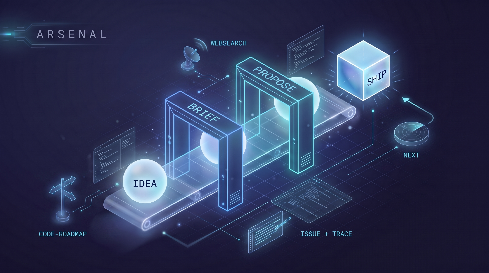
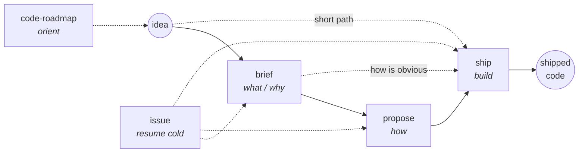

<p align="center">
  
</p>

<h1 align="center">arsenal</h1>

<p align="center">
  <a href="./LICENSE"></a>
</p>

<p align="center">
  Mirko Bozzetto's curated skills for AI coding agents: a spec-driven build pipeline plus the tools around it.
</p>

Plain markdown skills, portable to any coding agent or CLI: Claude Code, pi, oh-my-pi, Cursor, Codex. Install one plugin or all eight.

---

## What's in the arsenal

| Plugin | What it does | You type |
|--------|--------------|----------|
| 🧭 [`code-roadmap`](./plugins/code-roadmap) | Tells you which path fits the task. Advisory, never forces. | `/code-roadmap add OAuth login` |
| 📝 [`brief`](./plugins/brief) | The **what & why**. Interview → product spec + task list. | `/brief add OAuth login` |
| ⚖️ [`propose`](./plugins/propose) | The **how**. Alternatives, tradeoffs, risks, plan. One page or a few, hard ceilings. | `/propose OAuth token storage` |
| 🚀 [`ship`](./plugins/ship) | The **build**. Executes the spec, hands back a verification bundle. | `/ship docs/brief/oauth-login/` |
| 🐛 [`issue`](./plugins/issue) | The 1am bug, logged so you can pick it up cold. | `/issue log this bug` |
| 🧵 [`next`](./plugins/next) | Monday morning: what's open, what's next, exact resume command. | `/next` |
| 👣 [`trace`](./plugins/trace) | Progress ledger that writes itself. A hook, not a habit. | nothing |
| 🔎 [`websearch`](./plugins/websearch) | Intent-routed web search via [Exa](https://exa.ai), 8 modes. | `/websearch <question>` |

---

## The pipeline 🛤️

An idea enters, passes the gates it needs, comes out as shipped code.


```mermaid
flowchart LR
    R[code-roadmap<br/><i>orient</i>] -.-> I((idea))
    I --> B[brief<br/><i>what / why</i>] --> P[propose<br/><i>how</i>] --> S[ship<br/><i>build</i>] --> C((shipped<br/>code))
    I -.->|short path| S
    B -.->|how is obvious| S
    Q[issue<br/><i>resume cold</i>] -.-> B & P & S
```

**The short path is the default** - the same instinct as Basecamp's pitch, Linear's 1-2 page spec, Amazon's PR/FAQ: one document before code, more only when the rollback cost demands it.

| Your situation | Path |
|---|---|
| Reversible in a day, known pattern | `ship` it |
| One feature, obvious how | `brief → ship` |
| A choice to settle | `propose → ship` |
| A feature AND an open design question | `brief → propose → ship` |

Gates keep it honest: `ship` refuses a brief that is not `ready`, a proposal that is not `Accepted`.

Meanwhile, three tools watch your back, never in your way:

- 🧵 `/next` after any `/clear`: what's open, and the exact command to resume.
- 🐛 `/issue` when a bug must survive the night: hypothesis and state, resumable cold.
- 👣 `trace` writes the ledger on its own; `next` reads it, you type nothing.

**The document IS the deliverable** - each workflow ends on a clean HTML page: decision first, details after, presentable to a client.

---

## The lineage 📜

Plain names, old discipline. **propose** is the RFC tradition ([RFC 1, 1969](https://www.rfc-editor.org/rfc/rfc1.html), [Rust](https://rust-lang.github.io/rfcs/), [Oxide](https://oxide.computer/blog/rfd-1-requests-for-discussion)) plus [Nygard's one-page decision records](https://www.cognitect.com/blog/2011/11/15/documenting-architecture-decisions). **brief** is the PRD tradition ([Cagan](https://www.svpg.com/wp-content/uploads/2024/07/How-To-Write-a-Good-PRD.pdf)) sized by the short-doc school ([Google](https://www.industrialempathy.com/posts/design-docs-at-google/), [Shape Up](https://basecamp.com/shapeup/1.5-chapter-06), [Linear](https://www.lennysnewsletter.com/p/how-linear-builds-product)).

> The classic failure is letting the *what* and the *how* bleed together. One checkable artifact per question - that's the whole point.

---

## Why I built this

`brief` pins the what and why. `propose` settles the how. `ship` builds. 
The gates gave me a precision I never had; and when I just want to move, `ship` takes a one-line prompt. 
Discipline when the stakes call for it, out of the way when they don't.

Mirko

---

## Quick install ⚡ (Claude Code)

```bash
# Inside Claude Code:
/plugin marketplace add mirkobozzetto/arsenal

# Install the whole pipeline:
/plugin install code-roadmap@arsenal
/plugin install brief@arsenal
/plugin install propose@arsenal
/plugin install ship@arsenal
/plugin install issue@arsenal
/plugin install next@arsenal
/plugin install trace@arsenal

# ...or just one:
/plugin install ship@arsenal
```

Then drive the pipeline:

```bash
/code-roadmap add OAuth login          # orient
/brief add OAuth login                 # what/why  -> docs/brief/oauth-login/
/propose OAuth token storage           # how       -> the proposal document
/ship docs/brief/oauth-login/          # build     -> code + verification bundle + trace
/next                                  # what's left -> the next /ship, after any /clear
```

Per-plugin setup, flags, and dependencies live in each plugin's README.

---

## Good to know 🔧

- Published **as I actually use them** - adapt to your setup.
- Web lookups go through [Exa](https://exa.ai) MCP; `propose` also taps [GitNexus](https://github.com/mirkobozzetto/gitnexus) when present, greps when not.
- `ship` detects your toolchain (pnpm/bun/cargo/go/uv...) and **never runs your tests or builds** - it hands you the bundle.
- `issue` needs an authenticated `gh` CLI.
- **Other agents** (pi, oh-my-pi, Cursor, Codex): copy `plugins/<name>/skills/<name>/` into your agent's skill directory, wire the MCPs, done.
- Companion: [**espresso**](https://github.com/mirkobozzetto/espresso), the token-economy side. arsenal is what you build with; espresso keeps it cheap.

---

## License

MIT: see [LICENSE](./LICENSE).
