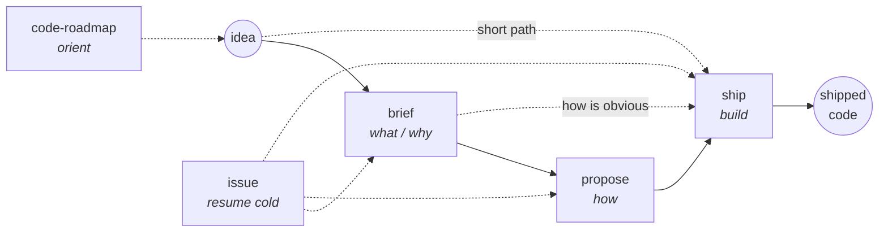

<p align="center">
  
</p>

<h1 align="center">arsenal</h1>

<p align="center">
  <a href="./LICENSE"></a>
  
  
</p>

<p align="center">
  Mirko Bozzetto's curated skills for AI coding agents: a spec-driven build pipeline plus the tools around it.
</p>

Skills here are plain markdown, portable across any coding agent or CLI (Claude Code, pi, oh-my-pi, Cursor, Codex, ...). Native plugin install is wired for Claude Code; every other agent can load the skill files directly. Every plugin installs on its own. Pick what you need.

---

## What's in the arsenal

| Plugin | Category | What it does | You type |
|--------|----------|--------------|----------|
| [`code-roadmap`](./plugins/code-roadmap) | orientation | At task start, matches your intent against the skills you have installed and prints a recommended chain + execution mode + reflection level. Advisory, never forces a path. | `/code-roadmap add OAuth login` |
| [`brief`](./plugins/brief) | planning | The *what* and *why*. Authors a product brief by interview (the PRD tradition, under a plainer name), then derives a nested task list. Stops before code. | `/brief add OAuth login` |
| [`propose`](./plugins/propose) | planning | The *how*. A design workflow in the RFC tradition: problem, alternatives, tradeoffs, design, risks, recommendation, impl plan. Two natural sizes with hard ceilings: one page for a bounded choice, a few pages for a real design question. Forces reasoning before action. | `/propose OAuth token storage` |
| [`ship`](./plugins/ship) | implementation | The *build*. Executes a finalized `brief` or an Accepted `propose` (or a bare prompt via an inline contract) on agent-teams / subagents / solo, and hands back a verification bundle you run + a trace ledger. | `/ship docs/brief/oauth-login/` |
| [`issue`](./plugins/issue) | memory | GitHub issues as cross-session resolution memory. Self-contained, cold-readable, resumable after any context reset. | `/issue log this bug`, later `resume issue #42` |
| [`next`](./plugins/next) | orientation | What's left and how to resume it. Derives an open-work board from `brief`/`propose` frontmatter and recommends the next command; a SessionStart hook auto-surfaces it so context survives `/clear`. | `/next` |
| [`trace`](./plugins/trace) | memory | A progress ledger that writes itself. A Stop hook logs the working-tree delta every turn that touched files (in `ship`, `propose`, or plain chat), so `next` shows what moved without you remembering to log it. | nothing: a hook logs it |
| [`websearch`](./plugins/websearch) | research | Intent-routed web search via [Exa](https://exa.ai) MCP: 8 modes (quick / deep / code / docs / debug / news / compare / research). | `/websearch <question>` |

**When the transversal three earn their keep.** `next` is Monday morning (or any `/clear`): three open workstreams, one command tells you which brief is `ready`, which proposal is `Accepted`, and the exact `/ship` to resume. `issue` is the gnarly bug you stop chasing at 1am: log the hypothesis and state to a GitHub issue, pick it up cold days later. `trace` is the hour of work done in plain chat that `ship` never stamped: a Stop hook records it, so `next` is not blind to it. They run alongside the pipeline, never as stages of it.

---

## The build pipeline

The four planning-to-build plugins form one chain. An idea enters, passes the **brief** gate (what/why) and, when the how is genuinely open, the **propose** gate (how), and comes out the other side as shipped code.


```mermaid
flowchart LR
    R[code-roadmap<br/><i>orient</i>] -.-> I((idea))
    I --> B[brief<br/><i>what / why</i>] --> P[propose<br/><i>how</i>] --> S[ship<br/><i>build</i>] --> C((shipped<br/>code))
    I -.->|short path| S
    B -.->|how is obvious| S
    Q[issue<br/><i>resume cold</i>] -.-> B & P & S
```

**The default path is the short one.** Small senior teams that ship well (Basecamp's Shape Up pitch, Linear's 1-2 page spec, Amazon's single iterated PR/FAQ) write ONE document before code, not a pipeline. arsenal works the same way: `brief → ship` is the normal route, and `propose` is the exception that must justify itself. The threshold is rollback cost, never diff size.

| Situation | Path |
|---|---|
| Reversible in under a day, known pattern | `ship` directly (inline contract) |
| One feature, the how is obvious | `brief → ship` |
| A choice to settle, small or large | `propose → ship` |
| A feature AND an open design question | `brief → propose → ship` |

**What each step applies to:**

1. **`code-roadmap`**: when you're unsure where to start. Applies to *any* task; it only orients, it never runs anything. Skip it once the path is obvious.
2. **`brief`**: when the *what/why* isn't pinned down yet. Applies to a new feature or product change. Output: `docs/brief/<slug>/{brief.md, tasks.md}`.
3. **`propose`**: when the *how* is a real question: several valid designs where the wrong one is expensive to undo, an architecture change, a migration, a new pattern. A bounded choice ("SQS over Kafka") gets the one-page size; a design question gets the full treatment. Output: a proposal with alternatives + tradeoffs + an impl plan.
4. **`ship`**: to build. Applies to executing a finalized `brief` (`status: ready`) or an Accepted `propose` (`status: Accepted`). Output: code + a `verification-bundle.md` you run yourself + a `trace.md` ledger.
5. **`issue`**: transversal. When a problem must survive a context reset, log it as a resumable GitHub issue and pick it up cold later.
6. **`next`**: transversal. Asks "what is left and how do I resume it" - derives the board from each `brief`/`propose` status and points at the next `/ship`. `ship` closes the loop (flips `ready`/`Accepted` to `shipped` on finish, and reconciles the `tasks.md` checkboxes from its trace so the board's task count is never stale, even under `-a`), and a SessionStart hook re-surfaces the board so a `/clear` never loses the thread.
7. **`trace`**: transversal. A ledger that writes itself. `next` derives its board from `brief`/`propose` status, and only `ship` stamps that, so `next` is blind to work done outside `ship`. `trace` fills that gap: a Stop hook logs the working-tree delta on any turn that touches files, in any context, so the work is recorded without you remembering to log it.

`trace` and `next` are the continuity pair: `trace` records what happened, `next` tells you what is left. The record is deterministic (a hook, not a habit), so nothing depends on remembering.

```
   ship    ┐
   propose ├──▶  any turn that touches files  ──▶  .claude/trace.md  ──▶  next reads it
   chat    ┘        (Stop hook, automatic)            (one ledger)        "what moved"
```

**The document is the deliverable.** Each workflow ends by rendering the finished document to a clean HTML page: status banner, executive summary first, the decision boxed before the argument (inverted pyramid), a side table of contents. Readable by a developer, presentable to a client.

---

## Where brief and propose come from

The names are plain on purpose; the artifacts are decades-old discipline, with the acronyms dropped at the door.

**propose** runs the RFC tradition: since Steve Crocker's [RFC 1](https://www.rfc-editor.org/rfc/rfc1.html) (1969), the move is to write the proposal down, weigh alternatives and tradeoffs, and reach consensus before building - the discipline behind the [Rust RFC process](https://rust-lang.github.io/rfcs/) and Oxide's [RFDs](https://oxide.computer/blog/rfd-1-requests-for-discussion). Its one-page size inherits from Michael Nygard's [decision records](https://www.cognitect.com/blog/2011/11/15/documenting-architecture-decisions): one decision, one page, never re-litigated.

**brief** runs the PRD tradition ([Marty Cagan](https://www.svpg.com/wp-content/uploads/2024/07/How-To-Write-a-Good-PRD.pdf)): state **what** a release does, **who** it is for, **why** it matters - and stay deliberately silent on how. The short-doc school ([Design Docs at Google](https://www.industrialempathy.com/posts/design-docs-at-google/), [Shape Up](https://basecamp.com/shapeup/1.5-chapter-06), [Linear](https://www.lennysnewsletter.com/p/how-linear-builds-product)) is why the short path is this pipeline's default.

> The single most common failure is letting the *what* and the *how* bleed together. Keeping `brief` upstream of `propose` upstream of `ship`, each a separate checkable artifact, is the whole point of the chain.

---

## Why I built this

`brief` pins down the what and the why. `propose` decides the how, when the how is a real question. `ship` executes.

Each stage keeps the previous one honest: `ship` refuses a brief that is not `ready` and a proposal that is not `Accepted`. The spec has to be real before code gets written - that gate gave me a precision I had never reached before.

But the chain is never forced on me: when I just want to move, I hand `ship` a one-line prompt and it ships. The discipline is there when the stakes call for it, out of the way when they do not.

- Mirko

---

## Quick install (Claude Code)

Add the marketplace once, then install whichever plugins you want:

```bash
# Inside Claude Code:
/plugin marketplace add mirkobozzetto/arsenal

# Install the whole pipeline:
/plugin install code-roadmap@arsenal
/plugin install brief@arsenal
/plugin install propose@arsenal
/plugin install ship@arsenal
/plugin install issue@arsenal
/plugin install next@arsenal
/plugin install trace@arsenal

# ...or just one:
/plugin install ship@arsenal
```

Then drive the pipeline:

```bash
/code-roadmap add OAuth login          # orient
/brief add OAuth login                 # what/why  -> docs/brief/oauth-login/
/propose OAuth token storage           # how       -> the proposal document
/ship docs/brief/oauth-login/          # build     -> code + verification bundle + trace
/next                                  # what's left -> the next /ship, after any /clear
```

Per-plugin setup, flags, and dependencies live in each plugin's README (linked in the table above).

---

## Dependencies, per plugin

Plugins are published **as I actually use them**: adapt them to your own setup.

- **`ship`**, **`brief`**: use [Exa](https://exa.ai) MCP for any web lookup (no native WebSearch/WebFetch). `ship` is toolchain-agnostic (detects pnpm/bun/yarn/npm, cargo, go, uv, ... from your lockfile) and never runs your tests/builds. It hands you a bundle to run.
- **`propose`**: optionally integrates [GitNexus](https://github.com/) for codebase context; degrades to grep/Read when it's absent. Uses Exa for prior-art research.
- **`code-roadmap`**: reads the skills you have installed this session; mentions index-gated code-intel tools and creator skills that you may or may not have. It only suggests, so adapt the chain to your toolbox.
- **`issue`**: needs the `gh` CLI authenticated, inside a GitHub repo.
- **`websearch`**: needs the Exa MCP server connected.

---

## Companion: espresso

[**espresso**](https://github.com/mirkobozzetto/espresso) is the token-economy side of this setup: a hooks-based installer that wires up RTK, Caveman, GitNexus and Exa so these skills run lean. arsenal is the *what you build with*; espresso is *how you keep it cheap*.

---

## Install on other agents (pi, oh-my-pi, Cursor, Codex, ...)

The skills are plain markdown. To use them outside Claude Code:

1. Copy `plugins/<name>/skills/<name>/` into your agent's skill/prompt directory.
2. Wire the agent's MCP config to whatever the skill needs (Exa for `ship`/`brief`/`websearch`, etc.).
3. Invoke per your agent's slash/skill mechanism.

---

## Contributing

Open an issue or PR at [github.com/mirkobozzetto/arsenal](https://github.com/mirkobozzetto/arsenal). One concern per PR. Bump the plugin's semver on any change that ships to users.

## License

MIT: see [LICENSE](./LICENSE).
