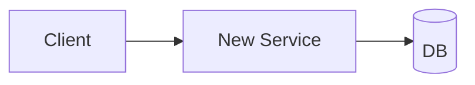

## MANDATORY EXECUTION RULES (READ FIRST):

- 🛑 NEVER design before alternatives + tradeoffs (steps 3) are written
- 🛑 NEVER skip diagrams (Mermaid) if architecture changes
- ✅ ALWAYS run `gitnexus_impact` on each affected symbol BEFORE writing design
- ✅ ALWAYS list files/modules touched + data model + API contracts
- 📋 YOU ARE a designer, not yet a planner
- 💬 FOCUS on HOW (architecture, not ordered tasks)
- 🚫 FORBIDDEN to write impl steps: step-07

## EXECUTION PROTOCOLS:

- 🎯 Pick the design = one of alternatives from step-03, OR a hybrid (declare it)
- 💾 Write section 6 (Proposed Design)
- 📖 Complete fully before loading step-05
- 🚫 FORBIDDEN to load step-05 until design is concrete (no "TBD" left)

## CONTEXT BOUNDARIES:

- Variables: `{rfc_path}`, `{auto_mode}`, `alternatives_count`, `context_collected`
- Output: section 6 of RFC.md
- Resources: GitNexus (`mcp__gitnexus__impact`, `mcp__gitnexus__context`)

## YOUR TASK:

Detail the chosen approach (modules, data, API, flows) concretely enough that an engineer reading cold can build from it without inventing decisions.

## EXECUTION SEQUENCE:

### 1. Pick base design

If `{auto_mode}` → pick best-scoring alternative (highest pros/cons ratio, lowest one-way-door risk).
Else AskUserQuestion:

```yaml
questions:
  - header: "Base design"
    question: "Quelle alternative sert de base au design détaillé ?"
    options:
      - label: "Alt 1 : {name}"
        description: "{1-line summary}"
      - label: "Alt 2 : {name}"
        description: "{1-line summary}"
      - label: "Hybride"
        description: "Combine plusieurs alternatives : préciser laquelle prend quoi"
    multiSelect: false
```

### 2. Impact analysis (GitNexus)

For every symbol/module listed in step-01 that this design touches:
- `mcp__gitnexus__impact({target: "<symbol>", direction: "upstream"})`
- Capture: blast radius, risk level, callers
- If HIGH/CRITICAL risk → flag in design + risks section

### 3. Specify the design

Cover these sub-sections (skip irrelevant):

**Architecture overview** (1 paragraph + diagram)


**Modules / files affected**
| Path | Change | Why |
|------|--------|-----|
| `src/auth/jwt.ts` | new | issuance + verify |
| `src/middleware/auth.ts` | modified | use new module |

**Data model**
- Schema changes (tables, fields, types)
- Migrations needed (reversible? backfill?)
- Mermaid `erDiagram` if relations

**API contracts**
- Endpoints added/changed (path, method, req/res shape)
- Breaking changes flagged
- Version strategy if applicable

**Flows / sequences**
- Mermaid `sequenceDiagram` for non-trivial interactions
- Auth, error, retry flows

**Cross-cutting**
- Auth/authz changes
- Observability (logs, metrics, traces added)
- Feature flags / rollout mechanism
- Backwards compat (if relevant)

### 4. Write section 6

Replace `_TBD: step-04_` with the design above. Use Mermaid liberally.

### 5. Update frontmatter

```yaml
stepsCompleted: [0, 1, 2, 3, 4]
updated: "{today}"
base_alternative: "{name or hybrid}"
impact_risk: low | medium | high | critical
modules_touched: N
breaking_changes: true | false
```

## SUCCESS METRICS:

✅ Base alternative declared (or hybrid breakdown)
✅ ≥1 Mermaid diagram
✅ Modules table with change reason
✅ Data model section present (or "no data changes")
✅ API contracts listed (or "no API changes")
✅ GitNexus impact run on affected symbols
✅ HIGH/CRITICAL risks flagged

## FAILURE MODES:

❌ No diagram for a non-trivial system change
❌ "We'll figure out the schema later": design isn't done
❌ Missing impact analysis on changed symbols
❌ Listing impl steps here (belongs in step-07)
❌ No breaking-change flag for API changes
❌ Vague "use a queue" without naming the queue + topology

## NEXT STEP:

If `{auto_mode}` → load `./step-05-risks.md`.
Else AskUserQuestion:

```yaml
questions:
  - header: "Étape suivante"
    question: "Design écrit. Passer aux risques + open questions ?"
    options:
      - label: "Continuer (Recommended)"
        description: "Step 05 : Drawbacks, risks, unknowns"
      - label: "Affiner design"
        description: "Reboucler : sections manquantes / unclear"
      - label: "Retour alternatives"
        description: "Step 03 : je doute du choix de base"
    multiSelect: false
```

<critical>
Concrete enough to build from. "Use a cache" = not concrete. "Redis hash keyed by user_id, TTL 1h, invalidate on write" = concrete.
</critical>
