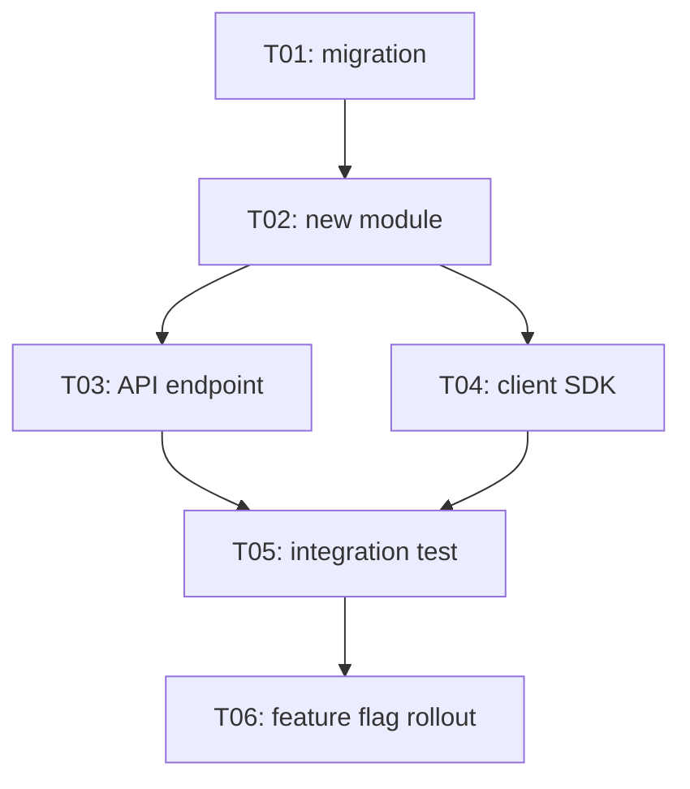
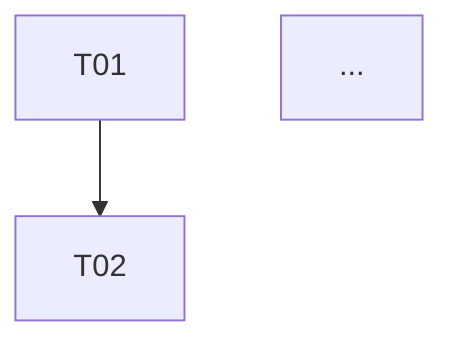

## MANDATORY EXECUTION RULES (READ FIRST):

- 🛑 NEVER execute tasks here: plan only
- 🛑 NEVER write tasks > 1 day of work: split them
- ✅ ALWAYS order tasks by dependency (topological)
- ✅ ALWAYS mark tasks parallelizable when independent
- 📋 YOU ARE a planner, not an executor
- 💬 FOCUS on ordered, sized, dependency-aware task list
- 🚫 FORBIDDEN to start coding: handoff via ship/sdd skills

## EXECUTION PROTOCOLS:

- 🎯 Each task = 1 PR ideally
- 💾 Write section 10 (Implementation Plan)
- 📖 Complete fully before loading step-08
- 🚫 FORBIDDEN to load step-08 until tasks have deps + acceptance criteria

## CONTEXT BOUNDARIES:

- Variables: `{rfc_path}`, `{auto_mode}`, `recommendation`, `modules_touched`, `breaking_changes`
- Output: section 10 of RFC.md
- Handoff: `ship` skill or `sdd` workflow consume this section

## YOUR TASK:

Decompose the chosen design into ordered, sized, independently-shippable tasks with acceptance criteria. Make execution mechanical.

## EXECUTION SEQUENCE:

### 1. List atomic tasks

Each task:
- **ID** (T01, T02, ...)
- **Title** (verb + noun, ≤ 60 chars)
- **Files touched** (paths from section 6)
- **Depends on** (other task IDs, or "none")
- **Acceptance criteria** (≥1 testable assertion)
- **Effort** (XS/S/M/L, XL means split)
- **Parallelizable with** (task IDs that can run alongside)

### 2. Order tasks

Pattern:
1. **Foundations**: schema migrations, new modules, types
2. **Implementation**: business logic, API, integrations
3. **Wiring**: feature flag, routing, observability
4. **Verification**: tests, perf benchmarks, security review
5. **Rollout**: gradual flip, monitoring
6. **Cleanup**: remove dead code, retire old paths

If any task is L+ → split into smaller before locking plan.

### 3. Map dependencies

Mermaid graph:


### 4. Verification plan

Per task, what test proves it works:
- Unit tests required
- Integration tests required
- Manual verification steps
- Perf/load test (if applicable)

### 5. Estimate timeline (optional)

If user wants:
- Sum efforts (XS=2h, S=4h, M=1d, L=2-3d)
- Parallelizable tasks shrink wall-clock
- Buffer 30% for unknowns from section 8

### 6. Write section 10

```markdown
## 10. Implementation Plan

### Tasks

| ID | Title | Files | Depends on | Effort | Accept criteria |
|----|-------|-------|------------|--------|-----------------|
| T01 | Add users.tenant_id migration | `db/migrations/...` | none | S | migration up + down, FK valid |
| T02 | New module `tenant-resolver` | `src/tenant/...` | T01 | M | resolve(req) returns tenant_id |
| T03 | Wire middleware | `src/middleware/auth.ts` | T02 | S | 401 if tenant missing |
| ... | ... | ... | ... | ... | ... |

### Dependency graph



### Verification
- Unit: T02 ≥90% coverage
- Integration: T03 happy + 3 error paths
- Perf: latency p99 < 10ms added (T03)

### Timeline (optional)
- Critical path: T01 → T02 → T03 → T06 → T07 ≈ 5 days
- Parallel tracks: T04 alongside T03
- Buffer: 30% → ~7 days realistic
```

### 7. Update frontmatter

```yaml
stepsCompleted: [0, 1, 2, 3, 4, 5, 6, 7]
updated: "{today}"
tasks_count: N
critical_path_days: K
```

## SUCCESS METRICS:

✅ All tasks have IDs, files, deps, acceptance criteria
✅ No task is L+ in effort (else split)
✅ Mermaid dep graph rendered
✅ Verification plan covers each layer (unit/integration/perf if relevant)
✅ Parallelizable tasks marked

## FAILURE MODES:

❌ "Implement feature X" as single task: not atomic
❌ Missing acceptance criteria → undefinable "done"
❌ No dep graph → reviewers can't spot bottlenecks
❌ All tasks sequential → missed parallelization
❌ No verification per task → ship-and-pray

## NEXT STEP:

If `{skip_review}` = true OR `{auto_mode}` → load `./step-09-finalize.md`.
Else AskUserQuestion:

```yaml
questions:
  - header: "Next step"
    question: "Impl plan written. Run the adversarial review (subagent)?"
    options:
      - label: "Continue to review (Recommended)"
        description: "Step 08: Adversarial review via subagent"
      - label: "Skip review -> finalize"
        description: "Step 09: RFC self-sufficient, no second opinion"
      - label: "Refine plan"
        description: "Loop back: tasks too big / deps unclear"
    multiSelect: false
```

<critical>
This section gets consumed by `ship` or `sdd` for execution. Quality of task split = quality of impl. Vague tasks → vague impl.
</critical>
